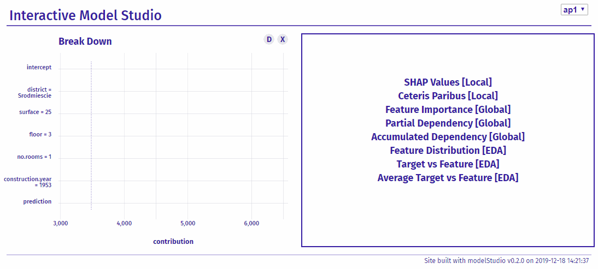
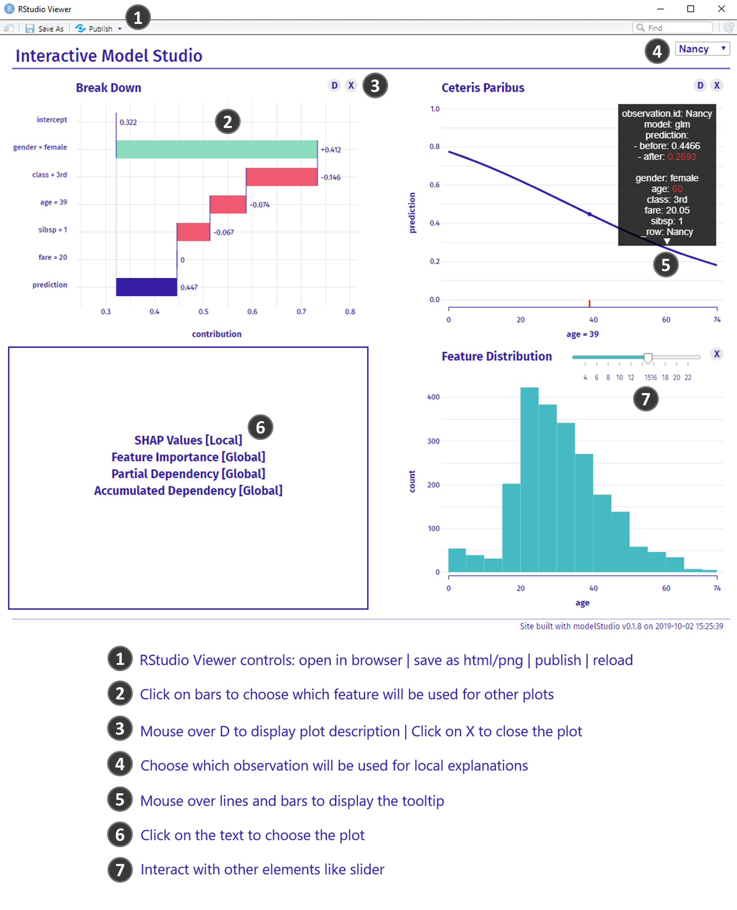

# modelStudio: Interactive Studio with Explanations for ML Models

[](https://www.repostatus.org/#active)
[](https://cran.r-project.org/package=modelStudio)
[](https://travis-ci.org/ModelOriented/modelStudio)
[](https://codecov.io/github/ModelOriented/modelStudio?branch=master)

## Overview

The `modelStudio` package automates explanation of machine learning predictive models. This package generates advanced interactive and animated model explanations in the form of serverless HTML site.

It combines **R** with **D3.js** to produce plots and descriptions
for local and global explanations. The whole is greater than the sum of its parts,
so it also supports EDA on top of that. ModelStudio is a fast and condensed way to get
all the answers without much effort. Break down your model and look into its ingredients
with only a few lines of code.

[See a demo](https://modeloriented.github.io/modelStudio/demo.html) &emsp; [Read the vigniette: modelStudio - perks and features](https://modeloriented.github.io/modelStudio/articles/vignette_modelStudio.html)  



The `modelStudio` package is a part of the [DrWhy.AI](http://drwhy.ai) universe.

## Installation

```r
# Install from CRAN: 
install.packages("ModelOriented/modelStudio")

# Install the development version from GitHub:
devtools::install_github("ModelOriented/modelStudio")
```

## Demo

This package bases on DALEX explainers created with `DALEX::explain()`.

```r
library("modelStudio")
library("DALEX")
```

Create a model:

```r
titanic_small <- titanic_imputed[, c(1,2,3,6,7,9)]
titanic_small$survived <- titanic_small$survived == "yes"

model_titanic_glm <- glm(survived ~ gender + age + fare + class + sibsp,
                         data = titanic_small, family = "binomial")
```

Wrap it into an explainer:

```r
explain_titanic_glm <- explain(model_titanic_glm,
                               data = titanic_small[,-6],
                               y = titanic_small[,6],
                               label = "glm")
```

Pick some data points:

```r
new_observations <- titanic_small[1:4,]
rownames(new_observations) <- c("Lucas", "James", "Thomas", "Nancy")
```

Make a studio for the model:

```r
modelStudio(explain_titanic_glm, new_observations)
```

More examples [here](https://modeloriented.github.io/modelStudio/articles/vignette_modelStudio.html).


------------------------------------------------

## Save

You can save `modelStudio` using controls on the top of the RStudio Viewer
or with [`r2d3::save_d3_html()`](https://rstudio.github.io/r2d3/articles/publishing.html#save-as-html)
and [`r2d3::save_d3_png()`](https://rstudio.github.io/r2d3/articles/publishing.html#save_d3_png).

<p align="center">
  
</p>

------------------------------------------------

## Cheat Sheet



------------------------------------------------

## Acknowledgments

Work on this package was financially supported by the 'NCN Opus grant 2016/21/B/ST6/02176'.
